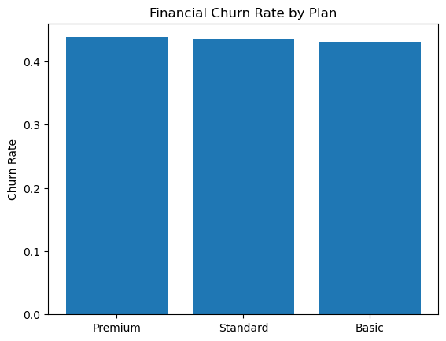

# SaaS Retention Analytics
## Executive Summary

This project analyzes customer churn and retention for a subscription-based SaaS company using Python. A customer-level feature table was built by combining transaction, subscription, and activity data. 

Key findings:
- Financial churn is approximately 43% of customers.
- Churn rates are similar across plan tiers, suggesting retention challenges are driven more by engagement than pricing.
- Silent churn (paying but inactive customers) represents a significant retention risk and an opportunity for re-engagement campaigns.

This analysis demonstrates how data can be used to identify at-risk customers, quantify revenue risk, and guide retention strategy.

## Client Background
A subscription-based SaaS company wants to better understand customer churn and retention patterns. Leadership is concerned about declining retention and wants to identify the key drivers of churn and opportunities to improve customer engagement.

Stakeholders:
- Executive leadership (retention and growth)
- Finance (revenue impact of churn)
- Product team (engagement and onboarding)
- Customer Success (at-risk accounts)

---

## North Star Metrics
Primary Metrics:
- Financial churn rate
- Active customer rate

Supporting Metrics:
- Engagement churn rate
- Silent churn rate
- Revenue per customer
- Cohort retention trends

---

## Executive Summary
- Financial churn is approximately 43% across customers.
- Churn rates are relatively consistent across plan tiers, suggesting pricing alone is not the main driver.
- Cohort analysis shows churn is stable across signup periods.
- Silent churn (customers paying but inactive) represents a significant retention risk.

Key Recommendation:
- Trigger outreach and engagement workflows for customers inactive for 30+ days.

---

## Data Structure & ERD

Datasets:
- customers.csv
- subscriptions.csv
- transactions.csv
- user_activity.csv

Relationships:
- Customers → Subscriptions (1-to-many)
- Customers → Transactions (1-to-many)
- Customers → User Activity (1-to-many)

Customer is the central entity used to build a customer-level feature table.

---

## Insights Deep Dive

### Churn by Plan
Churn rates are similar across Basic, Standard, and Premium tiers, indicating retention challenges are likely driven by engagement or product value rather than pricing alone.
## Sample Visualization

### Cohort Analysis
Financial churn remains relatively stable across signup cohorts, suggesting onboarding quality is consistent but overall retention requires improvement.

### Silent Churn
A large portion of customers continue to pay but are inactive, indicating a strong opportunity for re-engagement campaigns.

---

## Project Structure

